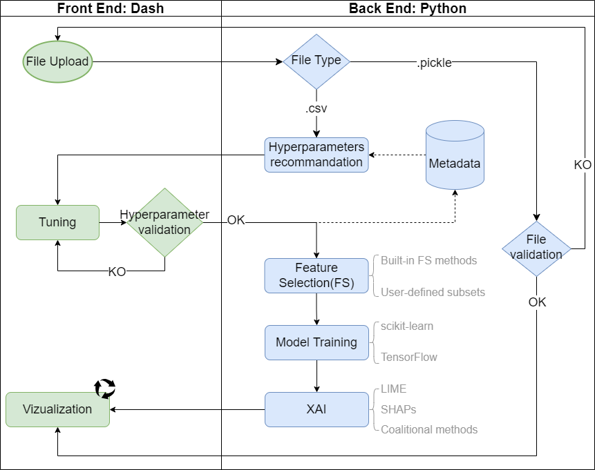
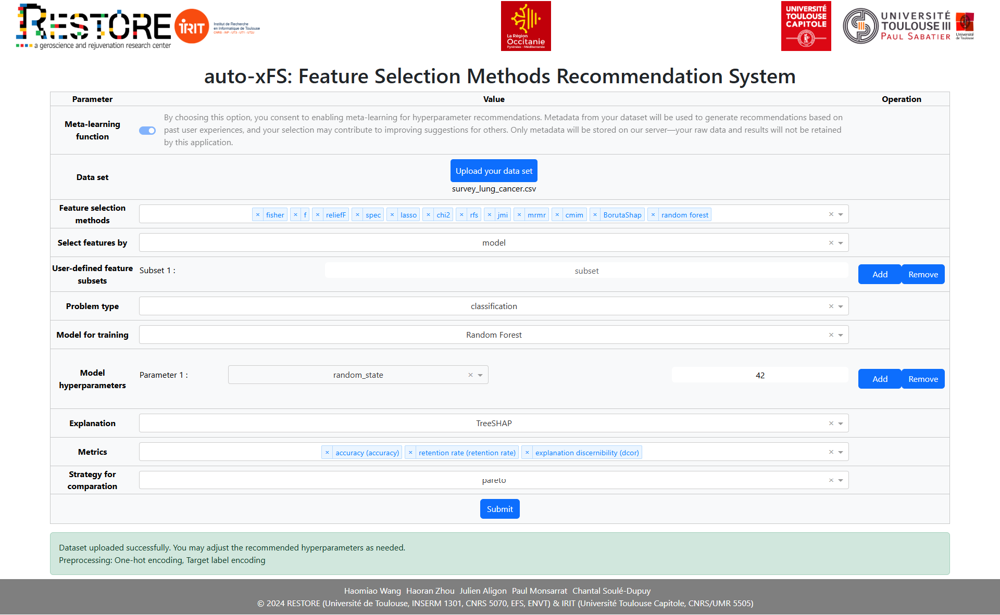
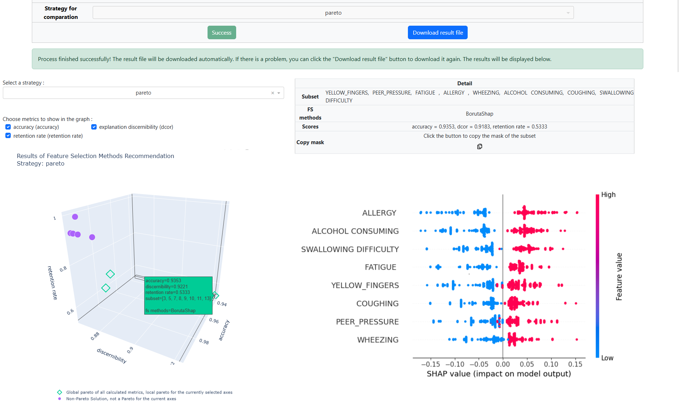
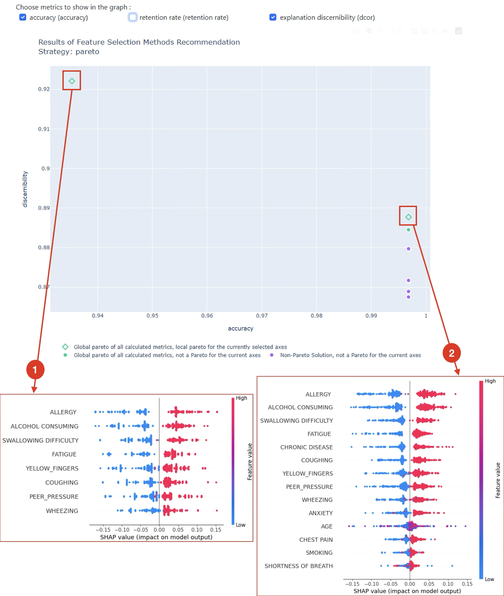

# auto-xFS: Feature Selection Methods Recommendation System

---

# auto-xFS

**auto-xFS** stands for **auto**mating e**x**plainable **F**eature **S**election. It is a web application developed
using [Plotly Dash](https://dash.plotly.com), designed to provide an Explanation-based feature selection tool for
building more meaningful and trustworthy machine learning models.

## Key features:

* **Feature Subset Generation**: Generate feature subsets using well-established feature selection methods or
  user-defined approaches.
* **Subset Evaluation**: Evaluate feature subsets using traditional and/or XAI-based metrics.
* **Result Investigation**: Provide interactive visualization tools to help determine solutions that best fit user
  needs.
* **Hyperparameter Recommendation**: assist users with meta-learning for hyperparameter tuning.

## Application Architecture

<p align="center">
   
</p>


---

## Live Demo

You can view the live version of **[auto-xFS](https://reco-xfs.irit.fr/) (https://reco-xfs.irit.fr/)**. We encourage and
appreciate your use of the web version, as it will continuously improve the mate-learning process. Your experience and
insights will benefit others in the community. However, if you prefer, you can also install the local version
by following the instructions in the next section.

## Local Installation

### Prerequisites

Before you begin, make sure you have the following installed on your local machine:

- [Conda](https://www.anaconda.com/docs/getting-started/miniconda/main)
- [Redis]() : auto-xFS assumes Redis is running on port `6379`. If needed, change the port by modifying the
  configuration in either the `web_app/app.py` file or the Redis configuration.

### Steps

1. Clone this project and navigate into the project directory:
   ```bash
   git clone https://github.com/jaligon/auto-xFS.git
   cd auto-xFS
   ```
2. Run the following command to create the `auto-xfs` Conda environment:
    ```bash
    bash -i script.sh
    ```
3. Activate environment and start the application on `localhost`. Since the application runs on port `80` by default,
   **`sudo`** may be required to bind to this privileged port. If needed, change the port by modifying the
   configuration in either the `web_app/app.py`.
   :
    ```bash
   conda activate auto-xfs
   sudo python -m web_app.app
    ```

## Examples of Use

A sample dataset ([suvey of lung cancer](https://www.kaggle.com/datasets/ajisofyan/survey-lung-cancer)) is available in
the [`example`](example) folder. You can also upload your own CSV file containing a **binary classification** or
**regression** problem.

Please make sure that the `target` variable is included in the **last column** of the CSV file.

The application automatically detects the structure of the CSV file and proposes suitable preprocessing steps, including
handling missing values, encoding categorical variables, and more.

### Dataset upload and hyperparameter recommendation

After uploading the [CSV file](example/survey_lung_cancer.csv), auto-xFS first applies encoding to the dataset since 
categorical columns are detected. 

<p align="center">
   
</p>

The hyperparameter recommendation can be toggled on or off. 
You can adjust all hyperparameter according to your needs and experience.

<p align="center">
   
</p>

### Subset evaluation

Once the calculation is completed, the [result file](survey_lung-cancer-dataset_example_SoftwareX2222.pkl)
is immediately available for download. It is possible to upload the result file in subsequent sessions to avoid
redundant calculations.

Each point on the three-dimensional (or two-dimensional) scatter plot represents a subset of features, colored according
to the evaluation strategy (e.g., `Pareto` in this example), which can be changed through the interface. You can adjust
the metrics on the axes and rotate the cube for better exploration. Detailed information will be displayed on the right
when a solution (point) on the cube is clicked.

<p align="center">
   
</p>

### Result investigation

A more focused illustration, only axes accuracy and discernibility have been considered to represent the subset of
features. It can be noted that the Pareto front (local to these two axes) contains two possible solutions (red squares):
one with higher accuracy and another with higher discernibility. Global explanations are also provided. It is noteworthy
that explanations with the highest discernibility yield clearer and more concise explanations (1) than those with the
highest accuracy (2); the age feature is particularly unreadable. Consequently, the user may opt to select the subset
with
the best discernibility, albeit at the expense of a slight loss in accuracy.

<p align="center">
   
</p>

## Citing auto-xFS

If you use the auto-xFS in a scientific publication, please consider citing at least one of the following papers:

* **H. Wang, E. Doumard, C. Soulé-Dupuy, P. Kémoun, J. Aligon and P. Monsarrat, "Explanations as a New Metric for
  Feature Selection: A Systematic Approach," in IEEE Journal of Biomedical and Health Informatics, vol. 27, no. 8, pp.
  4131-4142, Aug. 2023, doi: 10.1109/JBHI.2023.3279340.**

```bibtex
@article{Wang2023,
  author={Wang, Haomiao and Doumard, Emmanuel and Soulé-Dupuy, Chantal and Kémoun, Philippe and Aligon, Julien and Monsarrat, Paul},
  journal={IEEE Journal of Biomedical and Health Informatics}, 
  title={Explanations as a New Metric for Feature Selection: A Systematic Approach}, 
  year={2023},
  volume={27},
  number={8},
  pages={4131-4142},
  keywords={Computational modeling;Feature extraction;Measurement;Biological system modeling;Additives;Training;Data models;Biomedical;explainability;feature selection;machine learning;metrics},
  doi={10.1109/JBHI.2023.3279340}}
```

## License

This project is licensed under the **GNU General Public License v2.0** - see the [LICENSE](LICENSE) file for details.


---
**auto-xFS** was developed in the [IRIT](https://www.irit.fr/) and [RESTORE](https://restore-lab.fr/) labs, with funding
from the [Occitanie Region](https://www.laregion.fr/), the [University of Toulouse](https://www.univ-toulouse.fr/)
(grant ADI 2021, N°ALDOCT89533) and Agence Nationale pour la Recherche
([ANR-18-EURE-0003](https://anr.fr/ProjetIA-18-EURE-0003) & [PIA-11-INBS-0005](https://anr.fr/ProjetIA-11-INBS-0005)).
